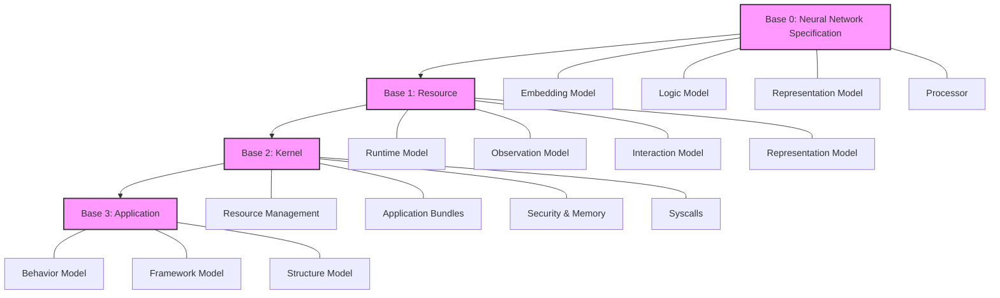
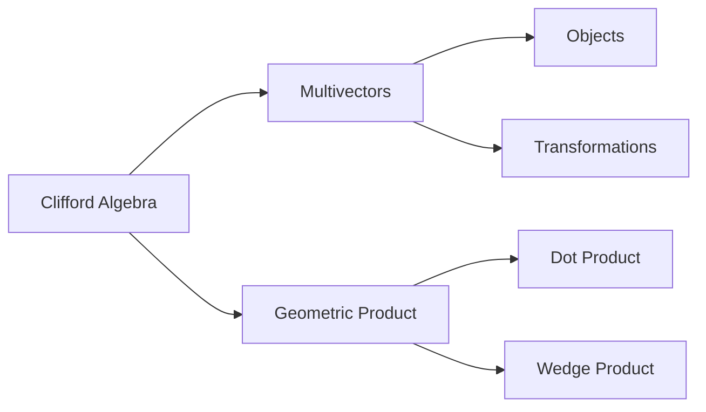
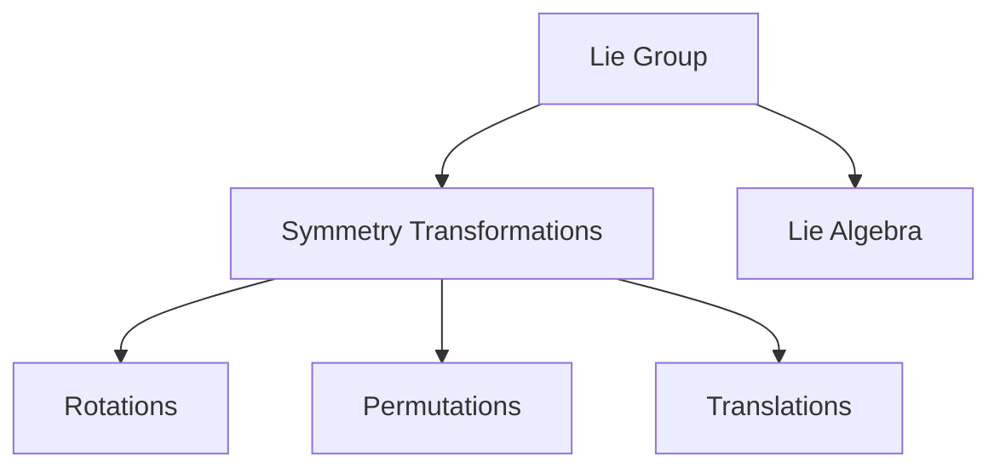
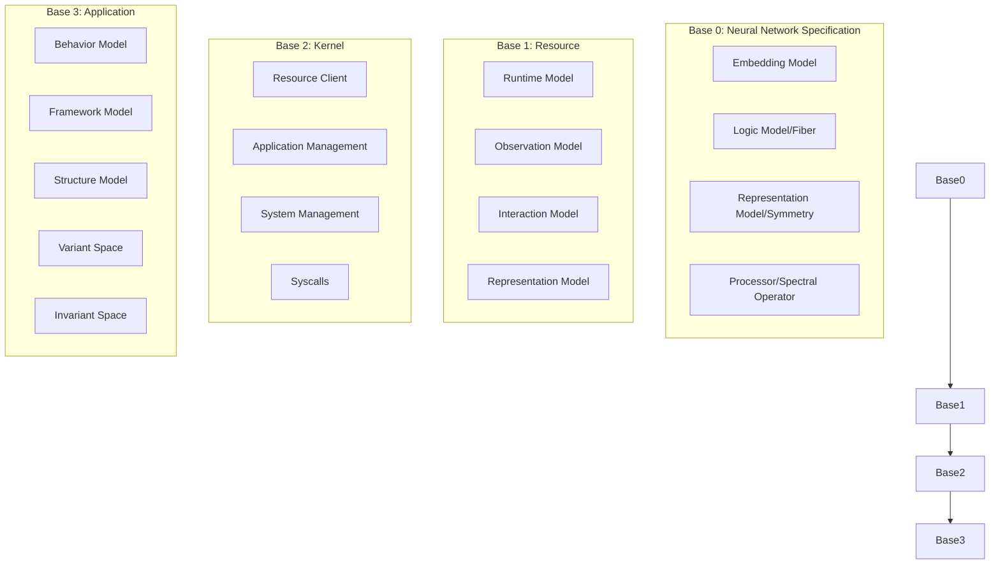
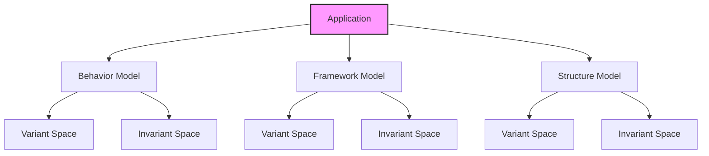
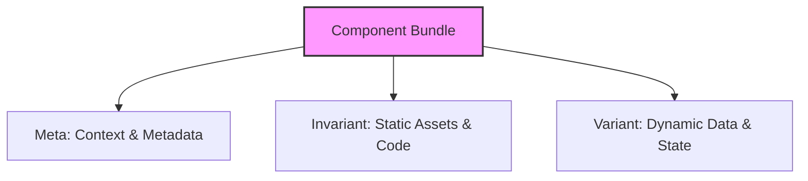
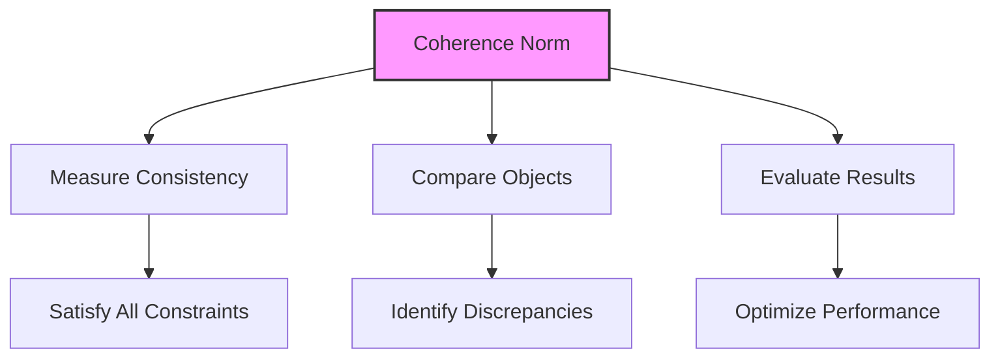
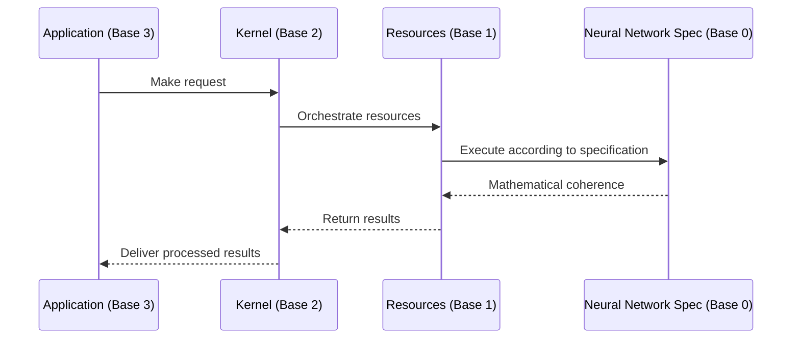

# PrimeOS Specification

## Overview

PrimeOS is a neural network-based operating system built on the Prime Framework, representing a fundamental shift in computing paradigms. Rather than traditional procedural execution, PrimeOS treats computation as a neural network process governed by mathematical coherence principles. This approach enables unprecedented consistency, adaptability, and resource efficiency throughout the system.

## Mathematical Foundation

PrimeOS is built on the Universal Object Reference (UOR) framework, which provides the mathematical foundation for the system. Understanding these mathematical structures is essential to comprehending how PrimeOS operates:

### Clifford Algebras and Geometric Structure

- **Clifford Algebras** (geometric algebras) serve as the mathematical foundation for representing data and operations in PrimeOS
- Each base in PrimeOS corresponds to a Clifford algebra fiber attached to a reference point in the manifold
- Multivectors in these algebras represent system objects, states, and transformations
- The geometric product enables both inner (dot) and outer (wedge) products, allowing for rich algebraic operations across the system

### Coherence and Inner Product Norms

The concept of coherence is mathematically defined in PrimeOS through:

- **Coherence Inner Product**: ⟨a,b⟩ₒ between elements in the Clifford algebra
- **Coherence Norm**: |a|ₒ = √⟨a,a⟩ₒ for measuring "self-consistency"

This mathematical coherence measures how well system components satisfy their specified constraints and maintain consistency with other components. Low coherence norm indicates high internal consistency, while high norm indicates contradictions or inconsistencies.

### Lie Groups and Symmetry Operations

- PrimeOS employs **Lie Groups** as symmetry operations that transform elements in the system
- These symmetry groups provide the mathematical foundation for operations that preserve certain invariants while transforming data
- The Lie algebra associated with these groups enables infinitesimal transformations and defines the "generators" of system operations
- Symmetry operations form the basis for data transformations, resource allocations, and state transitions in PrimeOS

## Prime Framework Architecture

PrimeOS is organized into four hierarchical bases, each implementing the Prime Framework's fundamental axioms while serving distinct functional roles.

### Terminology Mapping to Mathematical Concepts

The PrimeOS structure employs terminology derived from the mathematical foundation of the Prime Framework:

- **Base vs Layer**: We use "Base" rather than "Layer" to emphasize that each level serves as a mathematical foundation (or basis) for the levels above it, aligning with the mathematical concept of a basis in vector spaces and algebraic structures.

- **Fiber**: In the context of the Logic Model, "Fiber" refers to the Clifford algebra fiber attached to a point in the reference manifold. The Logic Model implements fiber bundle structures that enable consistent computational rules across different contexts.

- **Symmetry**: Associated with the Representation Model, "Symmetry" refers to the Lie group actions that transform elements in the Clifford algebra. These symmetry operations preserve certain structural invariants while allowing transformations needed for visualization and representation.

- **Spectral Operator**: The Processor is termed a "Spectral Operator" because it operates across the spectrum of the algebraic structure, facilitating communication between different components through transformations that preserve coherence across the system's spectral decomposition.

### Base 0: Neural Network Specification

Base 0 defines the abstract mathematical foundation and architecture for all PrimeOS components. It establishes the core axioms and principles that govern the entire system.

**Components:**
- **Base/Embedding Model**: Manages data representation, mathematical embeddings, and storage structures
- **Logic Model (Fiber)**: Controls computational rules, transformations, and processing logic
- **Representation Model (Symmetry)**: Handles visualization, expression, and output formatting
- **Processor (Spectral Operator)**: Facilitates communication between axioms and maintains coherence

Base 0 serves as an abstract class and generic framework that all system components must implement, ensuring mathematical consistency throughout the operating system.

### Base 1: Resource

Base 1 provides the lowest-level concrete implementation of the Prime Framework, translating abstract concepts into executable components. Resources directly correlate to the Prime Axioms.

**Resource Categories:**
- **Runtime Model (start/run)**: Executes Prime Foundation-based models and provides the runtime API
- **Observation Model (resolve/fetch)**: Handles data retrieval, monitoring, and system observations
- **Interaction Model (mutate/save)**: Manages state changes, data persistence, and component interactions
- **Representation Model (present/render)**: Controls user-facing outputs and visualization rendering

These resource categories form the operational foundation of PrimeOS, enabling all higher-level functionality while maintaining coherence with Base 0 principles.

### Base 2: Kernel (Orchestrator)

Base 2 functions as the orchestrator of PrimeOS, managing system resources and coordinating application execution according to coherence optimization principles.

**Key Functions:**
- Functions as the client to the Base 1 Resource API
- Allocates system resources based on coherence requirements
- Manages application bundles containing code and data
- Handles security, memory management, and process scheduling
- Exposes syscalls modeled as Applications for higher-level access

The kernel serves as the intermediary layer that bridges the low-level resources with the user-space applications, maintaining system integrity and optimizing performance.

### Base 3: Application (Userspace)

Base 3 represents the user-space of PrimeOS, where applications operate and interact with users. Every concrete implementation of a model in PrimeOS is an application.

**Application Structure:**
- **Behavior Model**: Defines how components act (similar to programming languages like JavaScript)
- **Framework Model**: Controls how components are organized (similar to CSS)
- **Structure Model**: Specifies what components are (similar to HTML)

**Application Components:**
- **Variant Space**: Contains dynamic data and state that changes during execution
- **Invariant Space**: Holds static assets and code that remain constant

Applications can perform computational tasks, interact with users through multi-media interfaces, utilize persistent storage, access network resources, and interface with device capabilities.

## Component Bundle Structure

All components within PrimeOS are neural network models expressed as bundles with three aspects:

1. **Meta**: Contextual information and metadata about the component
2. **Invariant**: Static assets and code that remain constant during execution
3. **Variant**: Dynamic data and state that changes during runtime

This consistent component model applies across all system layers, from kernel-level services to user applications.

## Core Principles and Innovations

1. **Coherence-Driven Computing**: All operations optimize for mathematical coherence, ensuring consistency across the system
2. **Universal Component Model**: Consistent design patterns applied across all system levels
3. **Functional Interface**: Pure functions and immutable data structures used throughout the system
4. **Neural Computation**: All components implemented as neural network models
5. **Resource Optimization**: Intelligent allocation based on coherence requirements

### Coherence as a Guiding Principle

In PrimeOS, coherence is not merely a design philosophy but a precise mathematical concept that drives system operation:

- Coherence is formally defined as the inner product norm |a|ₒ = √⟨a,a⟩ₒ for elements in the system's Clifford algebra
- Lower coherence norm values indicate higher internal consistency and fewer contradictions
- System operations aim to minimize coherence norm across all components, ensuring:
  - Constraints are simultaneously satisfied
  - Components interact without contradictions
  - Resource utilization is optimized
  - State transitions maintain consistency

Examples of coherence application in PrimeOS:
- Component interactions are evaluated by measuring the coherence between their interfaces
- Resource allocation decisions prioritize configurations with minimal coherence norm
- Application behavior is validated by checking coherence across model components
- Error detection relies on identifying areas of high incoherence (large norm values)

## System Flow

1. Applications (Base 3) make requests through the Kernel (Base 2)
2. The Kernel orchestrates Resources (Base 1) to fulfill these requests
3. Resources execute according to the Neural Network Specification (Base 0)
4. Results propagate back up through the bases, maintaining coherence at each level

This coherent flow enables PrimeOS to efficiently manage computational tasks while maintaining mathematical consistency throughout the operating system.

## Conclusion

PrimeOS represents a paradigm shift in operating system design, treating computation as a neural network process governed by mathematical coherence principles. By implementing the Prime Framework architecture throughout all system components, it achieves unprecedented consistency, adaptability, and resource efficiency while maintaining a clean separation between behavior, framework, and structure.

The system's foundation in Clifford algebras, coherence norms, and Lie group symmetries provides a mathematically rigorous basis for computation that fundamentally differs from traditional approaches. This mathematical underpinning enables PrimeOS to:

1. Maintain consistency across all system levels through coherence measurement
2. Optimize resource allocation based on minimizing coherence norm
3. Transform data through well-defined symmetry operations
4. Represent complex computational structures via multivector algebra
5. Ensure that all operations preserve fundamental mathematical invariants

As computing continues to evolve, the Prime Framework's mathematical approach offers a unified theory that bridges neural computation with traditional operating system functions, providing a foundation for future advances in computational systems.